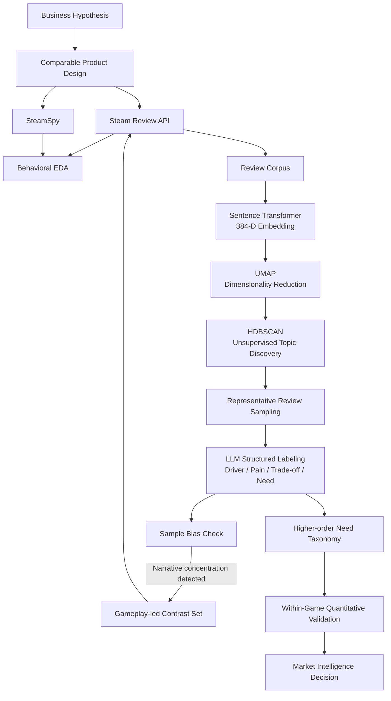

# AI Market Intelligence for Indie Game Commercialization

> **From a business hypothesis to customer evidence, AI-driven VoC discovery, robustness testing, and a commercialization decision.**

This project builds an AI-assisted Market Intelligence pipeline for indie game commercialization.

The starting question was not *“What features should the game have?”* but:

> **Why would a customer choose a smaller indie game when large AAA titles already compete for their time and budget?**

Using Steam market data and 10,411 customer reviews across 15 games, I designed a workflow that combines quantitative customer analysis, semantic embedding, unsupervised clustering, LLM-based Voice-of-Customer interpretation, and within-game validation.

The goal was not to make AI produce a convenient answer.  
The goal was to turn an ambiguous business intuition into **testable hypotheses and defensible product decisions**.

---

## 1. Business Context

While commercializing an indie game, I formed an initial hypothesis:

> Rather than competing head-on with AAA games on content volume, a smaller product may be able to target customers who actively explore new experiences and create an additional purchase occasion through a lower-entry-price, highly differentiated offering.

This contains two very different layers.

### Observable Questions

- Do exploration-oriented customers actually exist in the selected market?
- Do they exhibit broader game libraries or higher review activity?
- Can relatively short or lower-priced products still achieve high satisfaction?
- What recurring customer Needs and Pains appear in reviews?
- Which product attributes are associated with higher or lower recommendation within the same game?

### Strategic Inference

- If such a segment exists, can the product compete for additional **Share of Wallet** rather than positioning itself as a direct AAA substitute?

The second question is a commercialization hypothesis.

The available Steam data cannot directly observe wallet allocation, so it is deliberately not treated as a proven fact.

---

## 2. Research Hypotheses

| ID | Hypothesis | Final Verdict |
|---|---|---|
| H1 | An exploration-oriented customer segment exists | **Supported within observed sample** |
| H2 | AAA and indie purchases are complementary | **Unresolved** |
| H3 | A $5–15 price range can support a low-friction complementary position | **Partial / provisional** |
| H4 | A short but differentiated experience can still achieve high satisfaction | **Supported as feasibility** |
| H5 | Customer Needs/Pains can be discovered without pre-forcing categories | **Supported** |

The analysis intentionally preserves `Partial` and `Unresolved` conclusions rather than forcing every initial hypothesis to succeed.

---

## 3. Comparable Product Design

The initial analysis used 11 titles divided into three groups.

### Core Indie RPGs

- Meg's Monster
- In Stars And Time
- Small Saga
- Ikenfell
- Long Gone Days

### Positioning References

- OneShot
- To the Moon
- Finding Paradise
- Impostor Factory

### AAA Benchmarks

- Baldur's Gate 3
- ELDEN RING

The first AI analysis produced an important warning signal:

> **16 of 20 LLM-labeled cross-game clusters (80.0%) were categorized as `Narrative & Emotion`.**

Instead of interpreting this immediately as a market truth, I suspected **sample-selection bias** because the comparable set itself was heavily weighted toward narrative-driven games.

To test that possibility, four gameplay-led titles were added as a separate **Contrast Group**:

- Balatro
- Vampire Survivors
- Into the Breach
- Katana ZERO

The entire NLP pipeline was then rerun on the expanded 15-game dataset.

After expansion, strict `Narrative & Emotion` labels fell from:

**80.0% → 57.7%**

while independent themes such as:

- Gameplay Depth
- Replayability
- Content Longevity
- Technical Accessibility

emerged as separate customer Need regions.

This robustness experiment became one of the central results of the project.

---

## 4. Data

### Data Sources

#### Steam Reviews

Used for customer-level behavioral and VoC signals including:

- review text
- recommendation
- playtime at review
- number of games owned
- number of reviews written

#### SteamSpy

Used as a third-party market proxy for:

- estimated owner range
- price
- positive / negative counts
- current concurrent users
- tags

SteamSpy owner counts are treated as **estimates**, not actual unit sales.

---

## 5. Dataset

### Final 15-Game Dataset

- **15 games**
- **10,411 reviews**
- 3,000 Contrast reviews
- 3,000 Positioning reviews
- 2,911 Core reviews
- 1,500 AAA Benchmark reviews

For semantic topic discovery:

- **7,828 topic-eligible reviews**
- Sentence embedding dimension: **384**
- Detected English share: **95.6%**

Short or extremely sparse review texts were excluded from topic modeling.

---

## 6. End-to-End Pipeline



---

## 7. Why These Techniques?

### Sentence Transformer

Model:

`sentence-transformers/all-MiniLM-L6-v2`

Review text was converted into **384-dimensional semantic embeddings**.

Keyword counting alone is insufficient for reviews such as:

> "easy to learn but difficult to master"

and

> "I always come back to this game"

which may describe the same underlying Need without sharing important keywords.

Sentence embeddings allow reviews to be compared by semantic similarity rather than literal word overlap.

---

### UMAP

High-dimensional sentence embeddings were reduced to a lower-dimensional representation before density-based clustering.

UMAP was used to:

- preserve local semantic neighborhoods,
- reduce clustering complexity,
- create a clustering-friendly latent representation.

A separate 2-D projection was generated only for visualization.

---

### HDBSCAN

The number of customer Needs was unknown beforehand.

For that reason, K-Means was intentionally avoided because it would require selecting the number of clusters in advance.

HDBSCAN was used because it can:

- discover an unknown number of dense semantic regions,
- handle clusters with different shapes,
- assign ambiguous observations to **Noise**.

Final expanded run:

- **44 clusters**
- **43.9% Noise**

Noise is not interpreted as low-quality or negative reviews.

It represents reviews that were not sufficiently dense to support a conservative semantic topic assignment.

---

## 8. Representative Review Design

Simply sending the highest-probability reviews from each cluster to an LLM caused some clusters to become dominated by:

- a single game,
- memes,
- extremely narrow sub-topics.

To reduce this problem, representative reviews were diversified.

For each cluster:

- actual detected English reviews were prioritized,
- representation from multiple games was enforced,
- no more than two high-probability reviews per game were prioritized,
- negative reviews were deliberately included,
- duplicate recommendation IDs were removed.

This allowed the LLM to see both supporting and contradictory evidence.

---

## 9. Role of the LLM

The LLM was **not used to discover clusters**.

Its role was deliberately limited to interpreting already discovered semantic regions.

For each cluster, structured output included:

- label
- theme type
- customer Need category
- summary
- customer Need
- coherence
- evidence strength
- cross-game relevance
- actionability
- supporting review indices
- caveat

Possible theme types:

- `positive_driver`
- `pain_point`
- `mixed_tradeoff`
- `neutral_need`
- `non_actionable`

Generic praise such as:

> "best game ever"

was allowed to become `non_actionable` rather than being artificially converted into a product insight.

This separation was intentional:

> **Embedding / clustering discovers what customers repeatedly talk about.  
> The LLM translates those regions into product-planning language.**

---

## 10. Robustness Check: When the AI Result Looked Too Convenient

The first 11-game analysis heavily favored narrative-driven titles.

The result was:

- 20 cross-game LLM candidates
- 16 `Narrative & Emotion` labels
- **80.0% narrative concentration**

Instead of accepting this as the market answer, I questioned the experimental design itself.

Four gameplay-led Contrast titles were added and the entire pipeline was rerun.

### Expanded Result

- 15 games
- 10,411 reviews
- 44 semantic clusters
- 26 cross-game LLM candidates
- 21 actionable clusters

Narrative concentration decreased to:

**57.7%**

and new Needs emerged independently.

Examples:

### Roguelike Depth Versus Passivity

> Accessible gameplay loops are valuable, but insufficient run variation and excessive passivity can turn repetition into dissatisfaction.

### Compelling Replayability and Habit Loops

> Customers value immediately engaging experiences with meaningful mastery and variation, but repetitive or coercive-feeling progression can become a trade-off.

### Demand for More DLC

> Strong product engagement can generate explicit demand for additional content, updates, and expansions.

The result showed that the original AI output contained a real market signal, but was also influenced by the initial comparable-product design.

---

## 11. Final Customer Need Taxonomy

The 21 actionable semantic clusters were consolidated into seven higher-order Needs.

| Higher-order Need | Role |
|---|---|
| Emotional Narrative & Payoff | Selection Driver |
| Distinctive Presentation & Atmosphere | Selection Driver |
| Narrative Pacing & Experience Density | Product Guardrail |
| Gameplay Depth & Agency | Product Guardrail |
| Replayability & Returnability | Selection Driver |
| Content Longevity & Expansion | Post-purchase Expansion Signal |
| Technical Accessibility | Product Guardrail |

---

## 12. Quantitative Cross-Validation

LLM interpretation alone was not treated as sufficient evidence.

Each Need was joined back to:

- recommendation,
- playtime,
- game,
- comparison group.

A second validation was then performed **within each game**.

This compares reviews associated with a specific Need against other reviews from the same product, reducing the influence of differences in the games' baseline satisfaction.

### Within-Game Results

| Customer Need | Median Recommendation Delta | Consistency |
|---|---:|---:|
| Content Longevity & Expansion | **+6.83%p** | 4 / 4 games positive |
| Replayability & Returnability | **+5.31%p** | 5 / 5 positive |
| Distinctive Presentation & Atmosphere | **+5.11%p** | 12 / 12 positive |
| Emotional Narrative & Payoff | **+4.20%p** | 11 / 15 positive |
| Narrative Pacing & Experience Density | -1.04%p | 5 positive / 6 negative |
| Gameplay Depth & Agency | **-13.69%p** | 11 / 15 negative |
| Technical Accessibility | **-20.19%p** | 4 / 6 negative |

These are **associations**, not causal effects.

---

## 13. Key Findings

### 1. An Exploration-Oriented Segment Was Observable

Among reviewers with a non-zero reported library size:

| Group | Median Games Owned |
|---|---:|
| AAA Benchmark | 100.5 |
| Gameplay-led Contrast | 155.0 |
| Positioning Indie | 166.5 |
| Core Indie RPG | **351.0** |

Median review activity showed a similar pattern:

| Group | Median Number of Reviews |
|---|---:|
| AAA Benchmark | 4 |
| Gameplay-led Contrast | 10 |
| Core Indie RPG | 12 |
| Positioning Indie | 12 |

The result does not imply that all indie customers behave this way.

It suggests that the observed niche indie customer sample contains a segment with unusually broad product exploration behavior.

---

### 2. Content Volume Is Not a Necessary Condition for Satisfaction

Six games in the sample showed:

- median playtime at review ≤ 8 hours
- sample recommendation ≥ 92%

Narrative-focused products with relatively short playtime also appeared in high-recommendation emotional-payoff clusters.

This supports the **feasibility** of compact but high-impact products.

It does not prove that shorter playtime causes satisfaction.

---

### 3. Distinctive Identity Was the Most Consistent Positive Signal

`Distinctive Presentation & Atmosphere` showed:

- median within-game recommendation delta: **+5.11%p**
- **12 / 12 games positive**

The result suggests that the opportunity is not simply:

> "Use pixel art."

A more defensible interpretation is:

> **Build an immediately recognizable and internally coherent audiovisual identity.**

---

### 4. Narrative-led and Gameplay-led Products Create Value Differently

For narrative-led products, recurring value came from:

- emotional payoff
- character attachment
- memorable endings
- music
- visual identity

For gameplay-led products, recurring value came from:

- immediate core-loop clarity
- replayability
- meaningful variation
- mastery
- unlock / progression systems

Both can create a strong reason to choose a smaller product without matching AAA content volume.

---

### 5. A Strong Hook Does Not Replace Product Depth

`Gameplay Depth & Agency` showed:

- median within-game recommendation delta: **-13.69%p**
- negative signal in **11 / 15 games**

Reviews repeatedly criticized:

- shallow combat
- passive progression
- repetitive loops
- insufficient interaction
- weak run variation

A differentiated product hook can create interest, but weak execution can still destroy satisfaction.

---

## 14. Commercialization Interpretation

The final product strategy is not:

> **"Offer more content for less money."**

It is:

> **Build a compact product with an immediately recognizable reason to choose it.**

For narrative-led products, that reason may be:

**Emotional Payoff + Distinctive Identity**

For gameplay-led products:

**Immediate Core Loop + Replayability + Meaningful Variation**

The observed exploration-oriented segment and successful low-entry-price products further motivated the strategic hypothesis that a smaller game may be better positioned as an **additional purchase occasion** rather than a direct AAA substitute.

This is the basis for a Share-of-Wallet commercialization hypothesis.

However:

> **Actual AAA-to-indie wallet allocation was not observed in the available data.**

Therefore Share of Wallet remains a **business inference**, not an empirically proven result of this project.

---

## 15. What Changed During the Analysis?

One of the most important outcomes of this project was not a specific model output.

It was the change in the analytical process itself.

```text
Initial business intuition
        ↓
Testable hypotheses
        ↓
Quantitative customer analysis
        ↓
Semantic VoC discovery
        ↓
LLM interpretation
        ↓
Unexpected narrative concentration
        ↓
Question the sample, not only the model
        ↓
Add gameplay-led Contrast Group
        ↓
Rerun the entire pipeline
        ↓
Discover additional Needs
        ↓
Within-game validation
        ↓
Supported / Partial / Unresolved decisions
```

The AI result was treated as **evidence to interrogate**, not an answer to accept.

---

## 16. Technology Stack

### Language

- Python 3.10

### Data Processing

- pandas
- NumPy
- PyArrow

### Collection

- Steam Review API
- SteamSpy
- requests

### NLP / Machine Learning

- Sentence Transformers
- `all-MiniLM-L6-v2`
- UMAP
- HDBSCAN
- scikit-learn
- langdetect

### Generative AI

- OpenAI Responses API
- Structured Outputs
- Pydantic schema validation

### Visualization

- Matplotlib

---

## 17. Repository Structure

```text
steam-market-intelligence/
├── config/
│   └── games_master.csv
│
├── data/
│   ├── raw/
│   │   ├── steam_reviews/
│   │   └── steamspy/
│   │
│   ├── processed/
│   │   ├── games.parquet
│   │   ├── reviews.parquet
│   │   └── reviews_<appid>.parquet
│   │
│   ├── features/
│   │   ├── embeddings.npy
│   │   ├── embedding_index.parquet
│   │   ├── topic_corpus.parquet
│   │   ├── review_topics_initial.parquet
│   │   └── umap_cluster_embedding.npy
│   │
│   └── features_baseline_11games/
│
├── outputs/
│   ├── baseline_11games/
│   ├── take6/
│   ├── take7/
│   ├── take8/
│   ├── take9/
│   └── take10/
│       └── market_intelligence_decision_sheet.md
│
└── src/
    ├── collect_all.py
    ├── collect_steam_review.py
    ├── collect_steamspy.py
    ├── build_market_dataset.py
    ├── take6_eda.py
    ├── take6_h1_robustness.py
    ├── take6_market_analysis.py
    ├── take7_topic_discovery.py
    ├── take7_export_diverse_representatives.py
    ├── take8_prepare_llm_input.py
    ├── take8_llm_label_clusters.py
    ├── take9_cross_validate_needs.py
    ├── take9_within_game_validation.py
    └── take10_decision_sheet.py
```

The `Take` naming reflects the chronological analytical workflow used during development.

---

## 18. Running the Project

### Environment

```bash
python -m venv .venv
source .venv/bin/activate

pip install \
    pandas \
    pyarrow \
    numpy \
    requests \
    matplotlib \
    scikit-learn \
    umap-learn \
    sentence-transformers \
    langdetect \
    openai \
    pydantic
```

For LLM labeling:

```bash
export OPENAI_API_KEY="YOUR_API_KEY"
```

### Collect Market Data

```bash
python src/collect_all.py \
    --source steamspy
```

```bash
python src/collect_all.py \
    --source steam \
    --reviews 750
```

A specific comparison group can also be collected independently:

```bash
python src/collect_all.py \
    --source steam \
    --group contrast \
    --reviews 750
```

### Quantitative Market Analysis

```bash
python src/take6_eda.py
python src/take6_h1_robustness.py
python src/take6_market_analysis.py
```

### Semantic Topic Discovery

```bash
python src/take7_topic_discovery.py
```

After language sanity-checking the topic corpus:

```bash
python src/take7_export_diverse_representatives.py
```

> The current development version performed the language sanity check as an inline utility.  
> For public release, this step should be extracted into a standalone script such as `src/check_review_language.py`.

### Prepare and Label Customer Needs

```bash
python src/take8_prepare_llm_input.py
```

Individual clusters can be inspected first:

```bash
python src/take8_llm_label_clusters.py \
    --cluster 23
```

Then all candidate clusters:

```bash
python src/take8_llm_label_clusters.py \
    --all
```

### Cross-Validate the Need Taxonomy

```bash
python src/take9_cross_validate_needs.py
python src/take9_within_game_validation.py
```

### Generate the Final Decision Sheet

```bash
python src/take10_decision_sheet.py
```

Final output:

```text
outputs/take10/market_intelligence_decision_sheet.md
```

---

## 19. Important Outputs

### Quantitative Analysis

`outputs/take6/`

- library breadth by group / game
- Explorer share
- price vs recommendation
- playtime vs recommendation
- price-band summaries

### AI Topic Discovery

`outputs/take7/`

- cluster summary
- cluster quality
- representative reviews
- semantic cluster map

### LLM Customer Need Labels

`outputs/take8/`

- structured cluster labels
- LLM input evidence
- actionable / non-actionable classification

### Quantitative Cross-Validation

`outputs/take9/`

- cluster-level metrics
- higher-order Need metrics
- game-level Need metrics
- within-game comparison

### Final Market Intelligence Decision

`outputs/take10/market_intelligence_decision_sheet.md`

---

## 20. Limitations

This project intentionally separates observation from inference.

- Steam reviewers are not representative of every buyer.
- Reviews were collected as a bounded sample rather than a complete historical census.
- `num_games_owned == 0` is ambiguous and was excluded from library-breadth comparisons.
- SteamSpy owners are third-party estimates rather than actual sales.
- Current Steam price does not necessarily equal historical purchase price.
- Recommendation and playtime relationships are associations, not causal effects.
- Review-author overlap does not equal product-ownership overlap.
- Actual wallet spending and AAA-to-indie cross-purchase behavior were not observed.
- HDBSCAN cluster size does not directly represent market-share or Need importance.
- LLM labels are semantic interpretations of discovered clusters and were therefore cross-checked against quantitative signals and representative reviews.

The project therefore does **not** claim to prove Share of Wallet.

Instead, it produces evidence that can support or challenge a commercialization hypothesis.

---

## 21. Final Takeaway

This project began with a business intuition but ended with a different lesson:

> **A useful AI system for product planning should not merely generate an answer. It should make a business hypothesis easier to test, challenge, revise, and finally convert into a decision.**

The most important step was not the embedding model or the LLM call.

It was recognizing that the first AI result might reflect my own comparable-product selection, expanding the experiment with a gameplay-led Contrast Group, and changing the conclusion when the evidence changed.

That process turned AI from a text-generation tool into a practical **Market Intelligence workflow for product commercialization**.